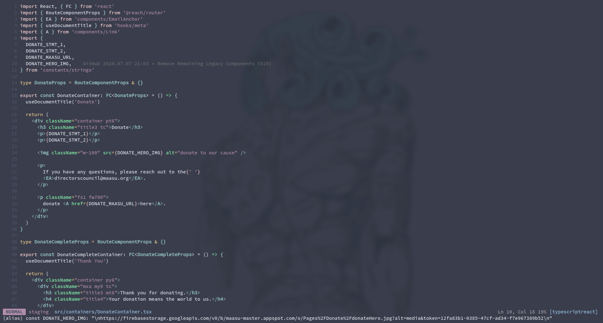

# NVIM
A modern [Neovim](https://neovim.io/) configuration created to be a more favorable code editor
alternative to Visual Studio Code



Its features include:
- multi-buffer support (native to vim)
- vim keybindings with additional add-ons (vim-surround, vim-commentary)
- version control support (git gutter, branch name)
- file explorer side-pane (nerdtree)
- fuzzy file finding and file searching (fzf)
- automated session saving
- toggleable terminal window (4+ terminal buffers)
- tag navigation and definitions (coc and tsserver plugin(s))
- general syntax, warning, and error highlighting

## Table of Contents
1. [Installation](#installation)
2. [Background](#background)
3. [Bindings and Commands](#bindings-and-commands)
3. [Roadmap](#roadmap)

## Installation <a name="installation"></a>
These instructions work for both Linux distributions and macOS. Windows may require some 
tweaking with WSL or puTTY.

1. Verify [Neovim](https://github.com/neovim/neovim/wiki/Installing-Neovim) 0.4+
    is installed. Certain functions available will not function properly on lower
    versions.
2. Clone this repository in `$XDG_CONFIG_HOME` (this is usually `~/.config/`).
    ```
    git clone https://github.com/bossley9/nvim.git $XDG_CONFIG_HOME/nvim
    ```
3. Open `neovim`. It should detect the configuration file and immediately 
    install all plugins.
4. Close and reopen `neovim` to ensure all plugins and configuration 
    settings are enabled.

If future updates are made to this configuration, you can pull the latest commits 
and `neovim` will automatically install any new plugins.

**While almost everything is automated by install, Coc extensions need to be installed 
manually**. Coc is the best alternative for auto completion, auto imports, defintions,
tag searching, etc for Typescript.

> I couldn't find a good way to automate this process, but it's better that this must be 
> done manually. All extensions are language-specific plugins, and it's better to provide a 
> bloat-free "opt-in" alternative rather than a bloated "opt-out" editor.

You can install Coc extensions with the command `:CocInstall extName`. Below are a list of
extensions I always install:
- `coc-css`
- `coc-json`
- `coc-tsserver`

If you are running this configuration in macOS, you will need to enable mouse reporting in your 
terminal's preferences to enable mouse support.

## Background <a name="background"></a>
I've used [Visual Studio Code](https://code.visualstudio.com/) for the past few years and it
definitely lives up to its name with beautiful interfaces, built-in language parsing and 
wonderful extension library.

But it's lacking a few features that would improve my productivity even further.

First, I have become much more efficient as a developer with vim keybindings. By default,
Visual Studio Code places much more emphasis on aesthetic than development efficiency. I can't
use vim keybindings without a plugin, and even using plugins, it limits the capability of
customizing keybindings.

Even the themes themselves are not as customizable as you'd think. I wanted a semi-opaque 
code editor and I wasn't able to implement that in Code, and the only way to make a truly
customized theme is to create one yourself.

But the biggest painpoint of Visual Studio Code is that it hoards resources.

For most machines, this is hardly an issue. But it's the concept that scares me. No code editor
should need to use as much memory as Google Chrome if all it manages are text files. This is a
classic example of "baked-in features that not everyone wants". A code editor should be
minimal, with the option for extensibility as needed.

Not to mention the fact that [telemetry is extremely creepy](https://stackoverflow.com/questions/40451596/visual-studio-code-still-accessing-internet-after-update-and-telemetry-was-disab).

I wanted an editing solution with high performance and small memory footprint that included 
all features I regularly would have used in a code editor. This configuration solves all of
these problems.

#### Vim vs Neovim
I chose Neovim over Vim as a basis due to its out-of-the-box support for gui-related functions 
used in the implementation of other features (such as the terminal buffer window). Neovim also 
provides consistency across platforms, making it easy to setup on any operating system.

#### How it works
Everything included in this configuration is either an open source plugin of vim or 
elementary vimscript hacking. I still consider myself a beginner at vimscript, and I've 
included as many comments as necessary in `init.vim` to make each group of logic easier to 
understand and easier to modify if desired.

## Bindings and Commands <a name="bindings-and-commands"></a>
Below is a summary of bindings and commands not native to vim that I currently use in my 
configuration. **I haven't included native bindings unless I modified them**, since vim 
bindings should be learned separately to these bindings. I also may not have included every 
binding or command since some bindings are legacy bindings for "just in case" scenarios, or 
extremely rare use-cases.

| mode | binding | functionality |
| --- | --- | --- |
| normal | `alt-k` / `alt-j` | Navigate up or down respectively by increments of 5. It's extremely useful and provides a finer scope of file navigation between single-line navigation (`k`, `j`) and page jumping (`ctrl-u`, `ctrl-d`). |
| normal | `alt-u` / `alt-d` | Navigate up or down respectively by increments of 25. This is intended to be used as a better alternative to `ctrl-u` abd `ctrl-d` since the `ctrl` key is misplaced on macOS machines. On both mac keyboards and standard keyboards, the `alt` key is generally placed in the same area. With this binding, it's also possible to customize the jump increments. |
| normal | `!` / `@` | Quick navigation to the start or end of a line. This is an alternative to the native `0` / `$` keybinding since both `!` and `@` are accessible by the same hand and are logically placed in sequential order. |
| normal | `ctrl-h` / `ctrl-j` / `ctrl-k` / `ctrl-l` | Alternatives to the standard method of switching between buffers with `ctrl-w [direction]`. This version is much more succinct. |
| normal | `space` | Removes highlights. Equivalent of typing `:noh`. |
| normal | `ZZ` / `ZQ` | Overwrites the native binding by saving session if applicable before quitting. |
| normal, visual | `alt-p` | Opens a project file fuzzy finder in a bordered window. Uses Ripgrep. | normal, visual, insert | `alt-b` | Toggles the file explorer side-pane. |
| normal, visual | `ctrl-c` | Copies the given selection or line to the clipboard. |
| normal | `ctrl-v` | Pastes the clipboard to the buffer in the same manner as the native `p` binding in vim. |
| normal, visual, insert, terminal | `alt-` | Toggles the terminal window. Within this window, switch to different terminal buffers using `alt-#` where # is the instance number. |
| normal, insert, visual | `alt-/` | Comment or uncomment the given line or line selection. |
| normal, visual | `tab` / `shift-tab` | Indent or unindent the line. |
| normal | `K` | Created as a counterpart to vim's native `J`. Whereas native `J` attaches the next line to the current line, `K` will separate the current line at the cursor and move the second half to the next line. Equivalent to entering insert mode and pressing `enter`. |
| normal | `alt-f` | File searching with native vim file regex searching. Equivalent to `/`. |
| normal, visual | `alt-F` | Project searching within all files. This is an equivalent of Visual Studio Code's project-wide searching but instead using Ripgrep. |
| normal | `alt-]` | Go to definition using Coc. This is where Coc extensions come in handy to be able to parse languages such as Typescript. |
| normal | `alt-o` | Go backwards in the tag stack. This essentially backward navigates through files and previous definition searching and works will in coordination with `alt-]`. The native vim equivalent of `ctrl-o`. |
| normal | `gk` | Both display the definition for a given tag or keyword. This binding uses an "opt-in" strategy by only displaying a definition when desireable. This increases performance and prevents definition windows from covering code. |
| insert | `alt-h` / `alt-;` / `alt-j` | These bindings are simply alternatives to `ctrl-h` (backspace), `ctrl-;` (`escape`), and `ctrl-j` (`enter`) using the `alt` key. |
| insert | `alt-k` / `alt-j` | Toggle and navigate autocomplete suggestions. I don't enable them by default because sometimes it automatically inserts random suggestions or covers other code with suggestions. This is an "opt-in" strategy which only displays autocomplete when desireable. |
| visual | `I` / `A` | Permutation insert, the equivalent of calling `0<C-v>I` or `$<C-v>A` on a selection. This is useful if you need to add a prefix or postfix to a large amount of lines. |
| command | `:Clear` | Cleans and removes all hidden buffers. This can potentially be useful in large projects with multitudes of hidden file buffers open. Additionally, closing the project using `ZZ` or `ZQ` will also clear all hidden buffers. |
| command | `:MarkdownPreview` | Renders a preview of the given markdown file in the system default browser. This is part of the markdown preview plugin. |
| command | `:TogglePrettier` | Toggles Prettier. Prettier is enabled by default, and it may make sense to temporarily disable Prettier. |
| command | `:W` | Calls `:w`. This is to prevent mistypings of `:w` from interfering with development. |

This configuration also includes all the fantastic word and object keybindings from the `vim-surround` plugin.

## Roadmap <a name="roadmap"></a>

- Hide `clang` warnings for libraries or header definitions
- Remove legacy tag functionality
- Fix/Remove code folding

